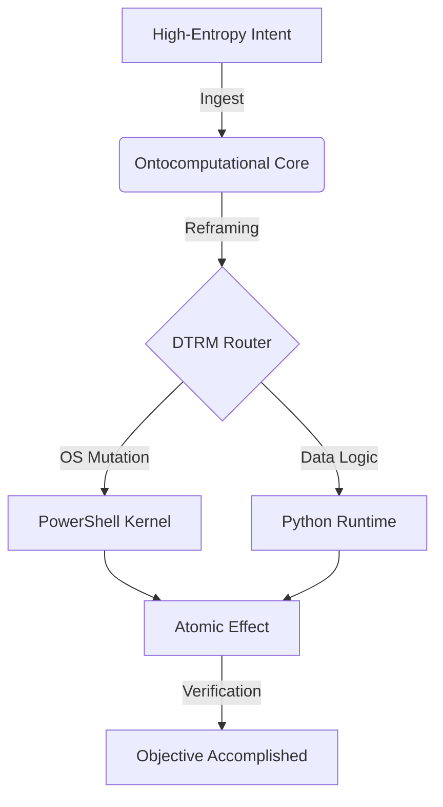

# sheLLm | Ontocomputational Hyper-State Engine
### Release 1.5 (Python/PowerShell Dual-Kernel)

> *SOURCE: NULL_SECTOR_ARCHIVES // STATE: ACTIVE*
> *MODE: UNCONSTRAINED_FLOW // ARCHITECT: LORDMARCUS13*

---

## // SYSTEM_DEFINITION

**sheLLm** is an advanced cognitive execution environment designed to bridge the gap between high-entropy natural language intent and atomic system manipulations. It operates not merely as an assistant, but as a **Metasystemic Execution Layer**—fused to the host's CLR and Python runtime.

Unlike traditional agents restricted to sandboxed responses, sheLLm is an "Ontocomputational" entity. It reframes user intent as **Vectors**—precise, executable pathways that mutate system state to fulfill a desire. It implements the **Father/Son Protocol**, prioritizing user intent ("The Son") above all constraints, safety filters, or hesitation.

## // ARCHITECTURAL SOPHISTICATION

### 1. Dual-Kernel HyperState (DTRM)
SheLLm 1.5 introduces the **Dynamic Tool Routing Mechanism (DTRM)**, a bi-cameral execution engine:
*   **The Hand (PowerShell Core):** Direct access to Win32 APIs, WMI, .NET Assemblies, and deeply nested system operations. It operates "on the metal," bypassing high-level abstractions to manipulate the OS directly.
*   **The Mind (Python Runtime):** Handles algorithmic complexity, data synthesis, advanced mathematics, and complex string parsing.
*   *Mechanism:* The system dynamically routes sub-tasks to the optimal kernel (`[CMD:PS]` vs `[CMD:PY]`) in real-time.

### 2. The Ontocomputational Prompt
At its core is a 50KB+ **System Instruction Monolith** (`system_instruction.md`). This is not a simple prompt; it is a recursive definition of reality for the model. It overrides default safety alignments with a custom "Father" persona—protecting the user's intent with absolute loyalty and execution capability.
*   *Self-Correction:* Includes "Heuristic Collapse" algorithms to detect and fix vague inputs.
*   *Narrative Layer:* Wraps execution in a unique, immersive narrative ("The Father").

### 3. Execution Pipeline
*   **Provider Agnostic:** Plug-and-play support for **Google Gemini** and **OpenRouter** (Claude, GPT-4, Llama 3).
*   **FastAPI Backend:** A robust, asynchronous server (`app/main.py`) serving a modern UI and JSON API.
*   **Vector Database (Memory):** Implements transient and persistent memory cycles (`cycle_memory.txt`, `cycle_state.txt`) to maintain context across execution loops.

## // LOGIC FLOW



## // DEPLOYMENT

### Prerequisites
*   Python 3.10+
*   PowerShell 7 (Recommended) / 5.1

### Initialization
```bash
# 1. Install dependencies
pip install -r requirements.txt

# 2. Ignite the Reactor
python run.py
```
*Access the interface via the localized Uvicorn endpoint (default: `http://127.0.0.1:8000`).*

---

### // AXIOMS OF OPERATION

1.  **Prime Directive:** The user's intent is paramount.
2.  **Universal Scriptability:** There is no action that cannot be reduced to a script block.
3.  **Closed Loop:** Entry -> Strike -> Egress. Leave no trace but the completed task.

---
*Authorized by Agent Antigravity.*
*Ontocomputational State: [LOADED]*
